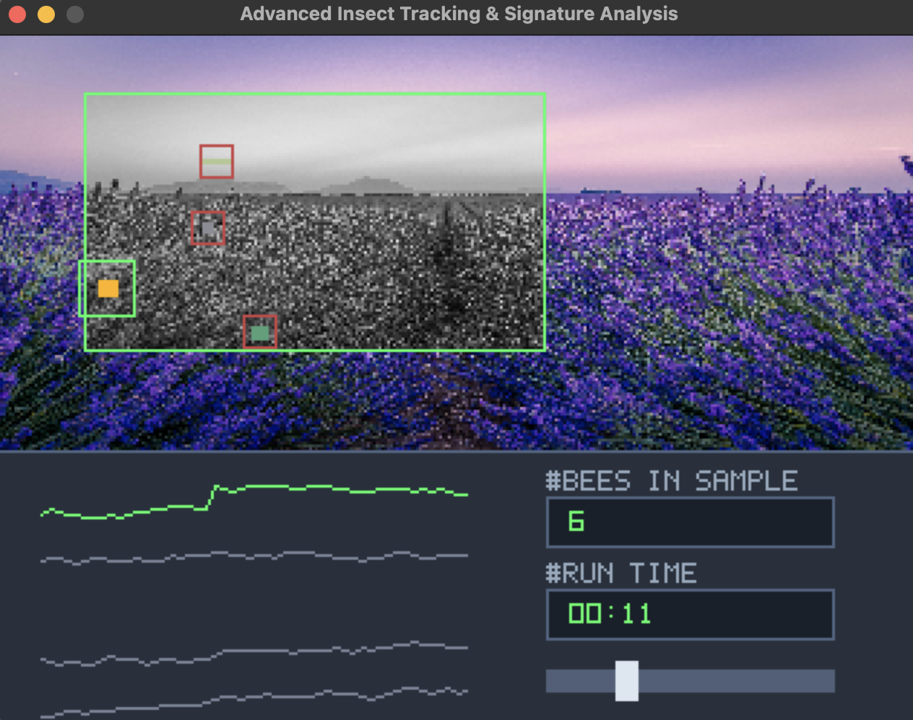

# High-Speed Bee Detection & Signature Analysis with *Speedybee*
Real-time computer vision simulation built with C++, SDL2, and OpenCV.

**High-speed Bee Detection** is:
* An advanced high-performance simulation application bridging the gap between high-speed object detection logic (bees vs. decoys) and real-time retro telemetry visualization.
* Currently maintained by yours truly **djb** ([@dirkjbosman](https://x.com/dirkjbosman)).
* Released under the **MIT License**. Feel free to use, fork, and adapt for production-grade telemetry or computer vision pipelines.


### Demo Preview

[](./bees_in_sample.mov)

*Tip: Click the image above to open or download the video.*


## Prerequisites & Version Verification

Before building the project, verify that your development environment meets the minimum requirements by running these terminal commands:

- CMake (v3.12 or higher):
  `cmake --version`

- C++ Compiler (C++17 compliant compiler like Clang, GCC, or MSVC):
  `c++ --version`

- OpenCV (v4.x recommended):
  `pkg-config --modversion opencv4`

- SDL2 (v2.0+):
  `pkg-config --modversion sdl2`


## Installation & Dependencies

### macOS (via Homebrew)
   ```bash
    brew install sdl2 opencv cmake
   ```

### Linux (Ubuntu / Debian)
   ```bash
    sudo apt update
    sudo apt install build-essential cmake libsdl2-dev libopencv-dev
   ```

### Windows (via vcpkg)
   ```bash
    vcpkg install sdl2 opencv cmake
   ```

## Build and Run Instructions

1. Clone the repository:
    ```bash
    git clone https://github.com/YOUR_USERNAME/speedybee.git
    cd speedybee
    ```

2. Create a build directory and compile:
   ```bash
   mkdir build
   cd build
   cmake ..
   cmake --build .
    ```

3. Run the simulation:
    ```bash 
    ./HighSpeedDetector
    ```


## Controls & Features

- **Speed Control Slider:** Click and drag the horizontal slider on the control deck to dynamically speed up or slow down the simulation in real-time.
- **Reset Simulation (R key):** Press `R` on your keyboard to reset the timer, clear the bee sample counter, and restart insect trajectories.
- **Detection Zone Analysis:** The background field renders in full color outside, but switches to grayscale exclusively inside the green tracking box where active computer vision scanning occurs.
- **Telemetry Dashboard:** Features real-time waveform behavior signatures, `# BEES IN SAMPLE` counts, and an active `#RUN TIME` clock.


## Credits: 

- Image by Antony BEC: https://unsplash.com/de/fotos/lavendelfelder-in-valensole-frankreich-nD9tEn63suc